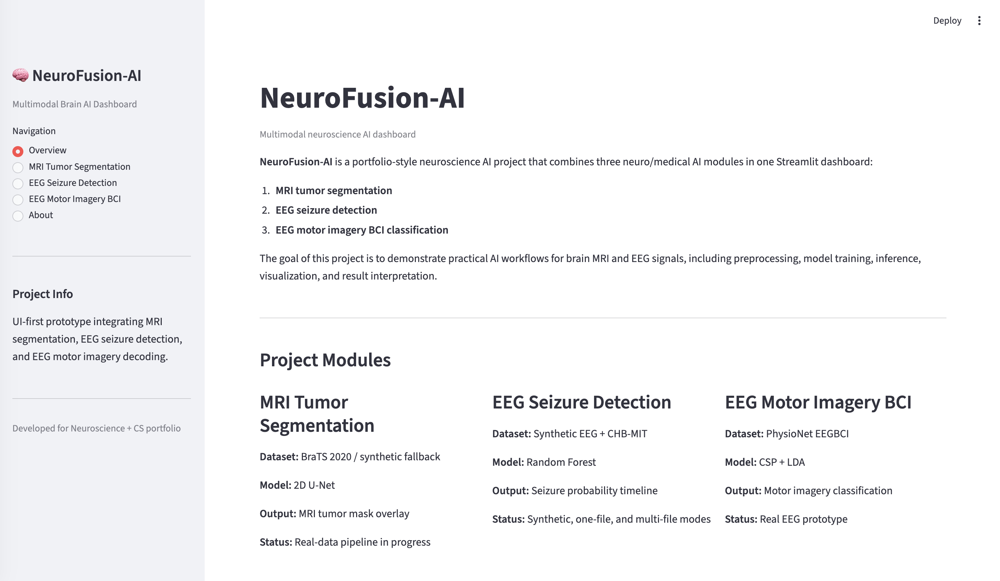
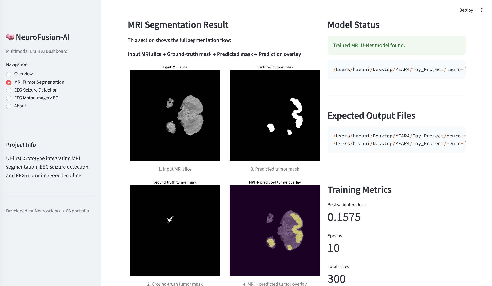
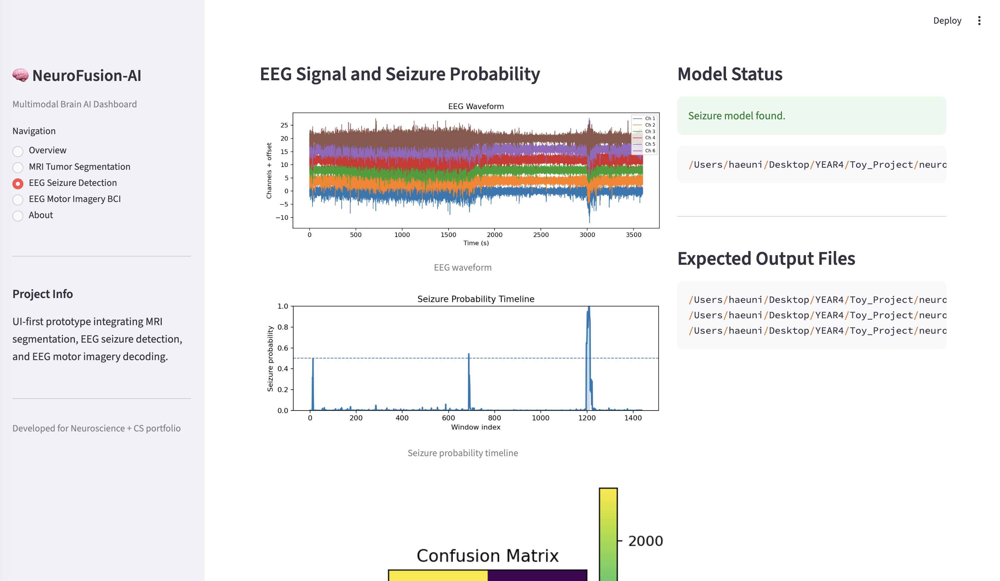
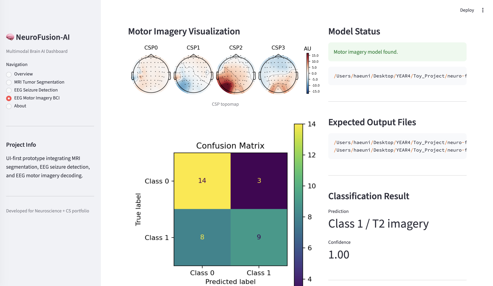

# NeuroFusion-AI

NeuroFusion-AI is a multimodal neuroscience AI dashboard that integrates three brain-related AI modules:

1. MRI tumor segmentation
2. EEG seizure detection
3. EEG motor imagery BCI classification

This project is designed as a practical portfolio project for neuroscience and computer science. It demonstrates how medical imaging and EEG signals can be processed, modeled, evaluated, and visualized in one Streamlit dashboard.

---

## Project Overview

NeuroFusion-AI includes three main modules.

### 1. MRI Tumor Segmentation

This module uses a 2D U-Net model for brain tumor segmentation.

Current features:

- BraTS 2020 MRI preprocessing
- FLAIR MRI slice extraction
- Tumor mask generation from segmentation labels
- 2D U-Net training
- Predicted tumor mask visualization
- Ground-truth mask comparison
- Prediction overlay visualization
- Dice score calculation

Main outputs:

```text
models/mri_unet.pt
results/mri/mri_input_slice.png
results/mri/mri_ground_truth_mask.png
results/mri/mri_predicted_mask.png
results/mri/mri_prediction_overlay.png
results/mri/training_curve_mri_unet.png
results/mri/mri_training_metrics.json
results/mri/mri_inference_metrics.json
```

The MRI page shows:

```text
Input MRI slice
Ground-truth tumor mask
Predicted tumor mask
MRI + predicted tumor overlay
Dice score
Training metrics
```

---

### 2. EEG Seizure Detection

This module detects seizure-like activity from EEG signals using window-based feature extraction and a Random Forest classifier.

Supported modes:

1. Synthetic EEG demo
2. CHB-MIT one-file real EEG prototype
3. CHB-MIT multi-file real EEG prototype

Features used:

- Bandpower
- Entropy
- Line length
- Hjorth parameters

Main outputs:

```text
models/seizure_rf.pkl
models/seizure_rf_chbmit_one_file.pkl
models/seizure_rf_chbmit_multi_file.pkl

results/seizure/synthetic_waveform.png
results/seizure/synthetic_probability_timeline.png
results/seizure/synthetic_confusion_matrix.png

results/seizure/chbmit_chb01_03_waveform.png
results/seizure/chbmit_chb01_03_probability_timeline.png
results/seizure/chbmit_chb01_03_confusion_matrix.png

results/seizure/chbmit_multi_file_waveform.png
results/seizure/chbmit_multi_file_probability_timeline.png
results/seizure/chbmit_multi_file_confusion_matrix.png
```

The seizure page shows:

```text
EEG waveform
Seizure probability timeline
Confusion matrix
Data source description
Model status
Generation commands
```

---

### 3. EEG Motor Imagery BCI

This module classifies EEG motor imagery using CSP and LDA.

Current features:

- PhysioNet EEGBCI data loading
- 8–30 Hz band-pass filtering
- T1/T2 epoch extraction
- CSP spatial filtering
- LDA classification
- Confusion matrix visualization
- CSP spatial pattern visualization

Main outputs:

```text
models/motor_csp_lda.pkl
results/motor/confusion_matrix_motor.png
results/motor/csp_patterns.png
results/motor/motor_metrics.json
```

The motor imagery page shows:

```text
PhysioNet EEGBCI data source
CSP + LDA model status
Motor imagery prediction
Confusion matrix
CSP spatial patterns
Training metrics
```

---

## Dashboard

This project uses Streamlit as the dashboard framework.

Run:

```bash
python -m streamlit run app.py
```

Dashboard pages:

```text
Overview
MRI Tumor Segmentation
EEG Seizure Detection
EEG Motor Imagery BCI
About
```

---

## Installation

Create and activate a virtual environment.

```bash
cd ~/Downloads/neuro-fusion-ai
python3 -m venv .venv
source .venv/bin/activate
```

Install requirements.

```bash
pip install -r requirements.txt
```

If additional packages are needed:

```bash
pip install streamlit nibabel mne torch scikit-learn matplotlib tqdm joblib
```

Set Python path.

```bash
export PYTHONPATH=$PWD
```

---

## Recommended Project Structure

```text
neuro-fusion-ai/
│
├── app.py
├── README.md
├── requirements.txt
├── .gitignore
│
├── configs/
│
├── data/
│   ├── mri/
│   │   ├── brats_raw/
│   │   └── processed/
│   │       ├── images/
│   │       └── masks/
│   │
│   └── seizure_eeg/
│       └── chb01/
│
├── models/
│   ├── mri_unet.pt
│   ├── seizure_rf.pkl
│   ├── seizure_rf_chbmit_one_file.pkl
│   ├── seizure_rf_chbmit_multi_file.pkl
│   └── motor_csp_lda.pkl
│
├── results/
│   ├── mri/
│   ├── seizure/
│   └── motor/
│
├── scripts/
│   ├── prepare_mri_brats_slices.py
│   ├── train_mri_unet2d.py
│   ├── test_mri_unet_forward.py
│   ├── train_seizure_demo.py
│   ├── test_seizure_inference.py
│   ├── train_seizure_chbmit_one_file.py
│   ├── test_seizure_chbmit_one_file.py
│   ├── train_seizure_chbmit_multi_file.py
│   ├── test_seizure_chbmit_multi_file.py
│   └── train_motor_imagery.py
│
└── src/
    ├── common/
    ├── dashboard/
    ├── mri_segmentation/
    ├── seizure_detection/
    └── motor_imagery/
```

---

## How to Run the Full Pipeline

### 1. MRI Tumor Segmentation

Prepare BraTS slices:

```bash
python -m scripts.prepare_mri_brats_slices
```

Train MRI U-Net:

```bash
python -m scripts.train_mri_unet2d
```

Run MRI inference:

```bash
python -m scripts.test_mri_unet_forward
```

Expected outputs:

```text
models/mri_unet.pt
results/mri/mri_input_slice.png
results/mri/mri_ground_truth_mask.png
results/mri/mri_predicted_mask.png
results/mri/mri_prediction_overlay.png
results/mri/mri_inference_metrics.json
```

---

### 2. EEG Seizure Detection

Synthetic demo:

```bash
python -m scripts.train_seizure_demo
python -m scripts.test_seizure_inference
```

CHB-MIT one-file prototype:

```bash
python -m scripts.train_seizure_chbmit_one_file
python -m scripts.test_seizure_chbmit_one_file
```

CHB-MIT multi-file prototype:

```bash
python -m scripts.train_seizure_chbmit_multi_file
python -m scripts.test_seizure_chbmit_multi_file
```

---

### 3. EEG Motor Imagery BCI

Train CSP + LDA model:

```bash
python -m scripts.train_motor_imagery
```

Expected outputs:

```text
models/motor_csp_lda.pkl
results/motor/confusion_matrix_motor.png
results/motor/csp_patterns.png
results/motor/motor_metrics.json
```

---

### 4. Run Dashboard

```bash
python -m streamlit run app.py
```

---

## Data Sources

### BraTS 2020

BraTS 2020 is used for MRI tumor segmentation.

Expected structure after extraction:

```text
data/mri/brats_raw/
└── BraTS2020_TrainingData/
    └── MICCAI_BraTS2020_TrainingData/
        ├── BraTS20_Training_001/
        │   ├── BraTS20_Training_001_flair.nii
        │   ├── BraTS20_Training_001_t1.nii
        │   ├── BraTS20_Training_001_t1ce.nii
        │   ├── BraTS20_Training_001_t2.nii
        │   └── BraTS20_Training_001_seg.nii
        ├── BraTS20_Training_002/
        └── ...
```

In this project, the MRI preprocessing script uses:

```text
*_flair.nii
*_seg.nii
```

The segmentation mask is converted into a binary tumor mask using:

```text
seg > 0
```

---

### CHB-MIT Scalp EEG

CHB-MIT scalp EEG is used for seizure detection.

Expected structure:

```text
data/seizure_eeg/chb01/
├── chb01-summary.txt
├── chb01_03.edf
├── chb01_04.edf
├── chb01_15.edf
├── chb01_16.edf
├── chb01_18.edf
├── chb01_21.edf
└── chb01_26.edf
```

The CHB-MIT one-file prototype uses:

```text
chb01_03.edf
Known seizure interval: 2996–3036 sec
```

The multi-file prototype parses seizure intervals from:

```text
chb01-summary.txt
```

---

### PhysioNet EEGBCI

PhysioNet EEGBCI is used for motor imagery classification.

The pipeline includes:

```text
Raw EEG
8–30 Hz band-pass filtering
T1/T2 epoch extraction
CSP spatial filtering
LDA classification
```

The data can be downloaded automatically through MNE depending on the loader configuration.

---

## Evaluation Metrics

### MRI

The MRI module reports:

```text
Best validation loss
Dice score
Predicted tumor pixels
Ground-truth tumor pixels
```

Dice score measures the overlap between predicted tumor mask and ground-truth tumor mask.

```text
Dice score = 1.0 means perfect overlap
Dice score = 0.0 means no overlap
```

---

### Seizure Detection

The seizure module reports:

```text
Accuracy
F1-score
Sensitivity
Specificity
Precision
Confusion matrix
Probability timeline
```

---

### Motor Imagery

The motor imagery module reports:

```text
Accuracy
F1-score
Confusion matrix
CSP spatial patterns
```

CSP topomap interpretation:

```text
CSP patterns show spatial EEG channel combinations that help discriminate motor imagery classes.
They should not be interpreted as direct brain activation maps.
```

---

## Current Limitations

This project is an educational and portfolio prototype.

Limitations:

- The MRI model quality depends on the number of BraTS cases used for training.
- The MRI module currently uses 2D slices rather than full 3D volumetric segmentation.
- The seizure detector is not a clinical seizure detection system.
- CHB-MIT multi-file training is still subject-level, not patient-independent.
- Motor imagery classification accuracy may decrease when multiple subjects are mixed.
- The dashboard should not be used for clinical decision-making.

---

## Future Work

Planned improvements:

1. Improve MRI segmentation with more BraTS cases.
2. Add Dice score and IoU evaluation across many validation slices.
3. Extend MRI segmentation from 2D U-Net to 3D U-Net.
4. Expand seizure detection to patient-independent CHB-MIT validation.
5. Add false alarm rate per hour for seizure detection.
6. Add subject-level benchmarking for motor imagery.
7. Add upload functionality for EDF and NIfTI files.
8. Add model comparison, such as Random Forest vs CNN for EEG and 2D U-Net vs 3D U-Net for MRI.
9. Improve documentation and add screenshots.

---

## Screenshots

Recommended screenshot files:

```text
screenshots/overview.png
screenshots/mri_page.png
screenshots/seizure_page.png
screenshots/motor_page.png
```

Example README links:

```markdown




```

---

## Important Disclaimer

This project is for educational and portfolio purposes only.

It is not a medical device, clinical decision support system, or diagnostic tool.  
The results should not be used for patient care or clinical decision-making.