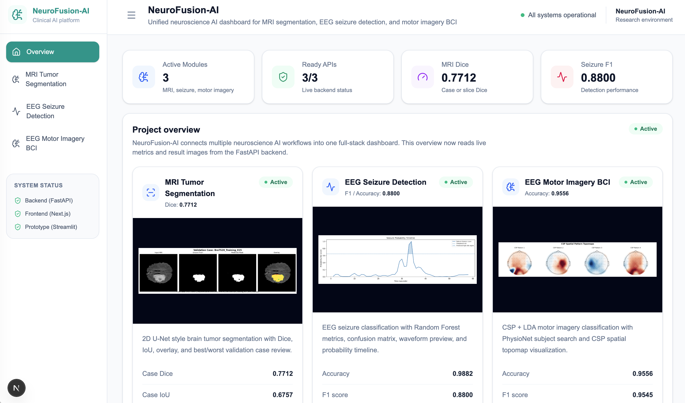
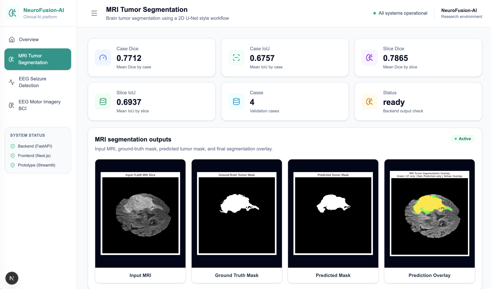
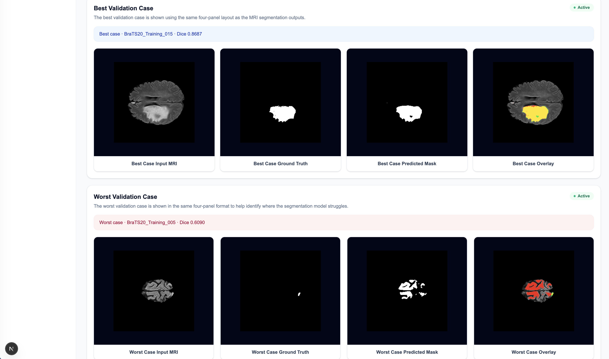
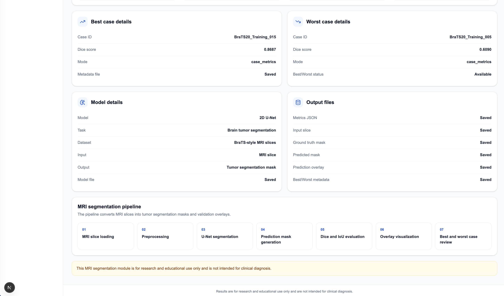
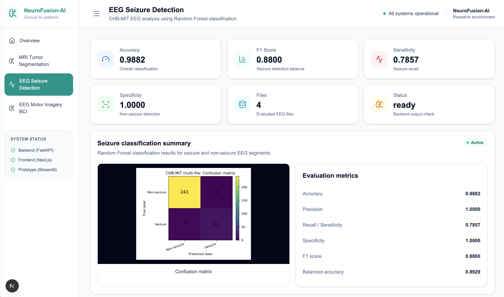
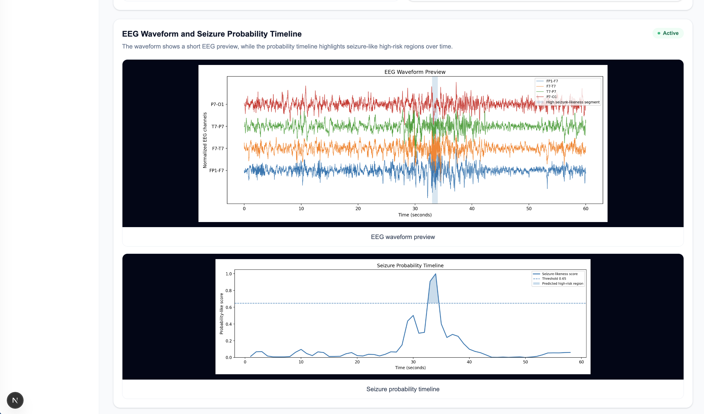
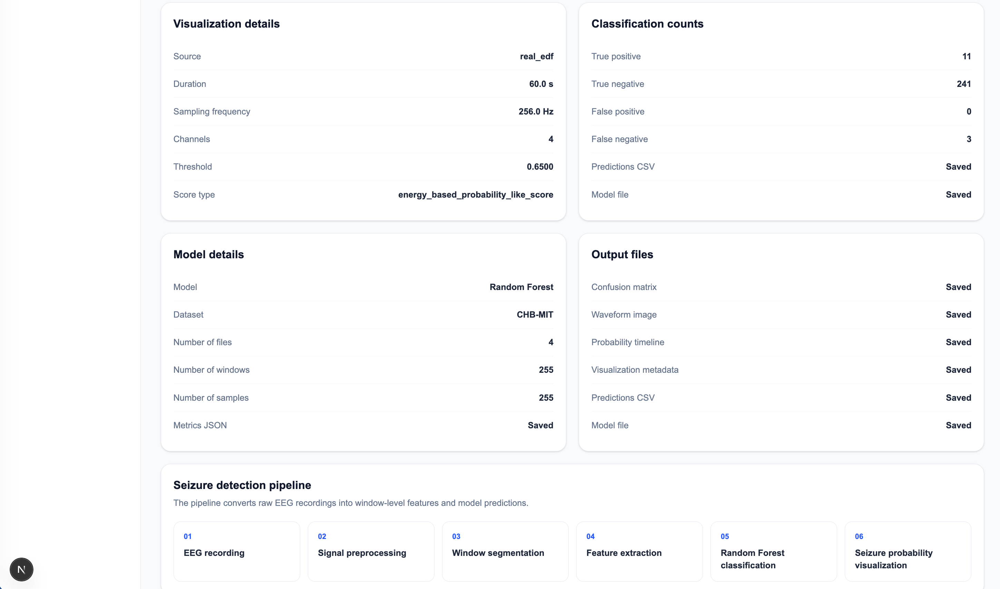
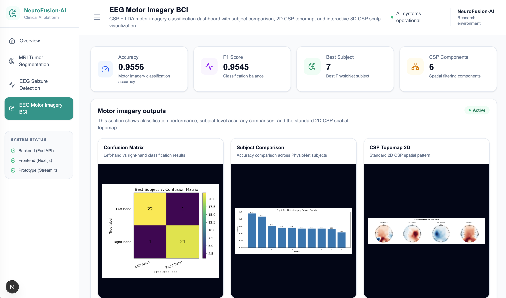
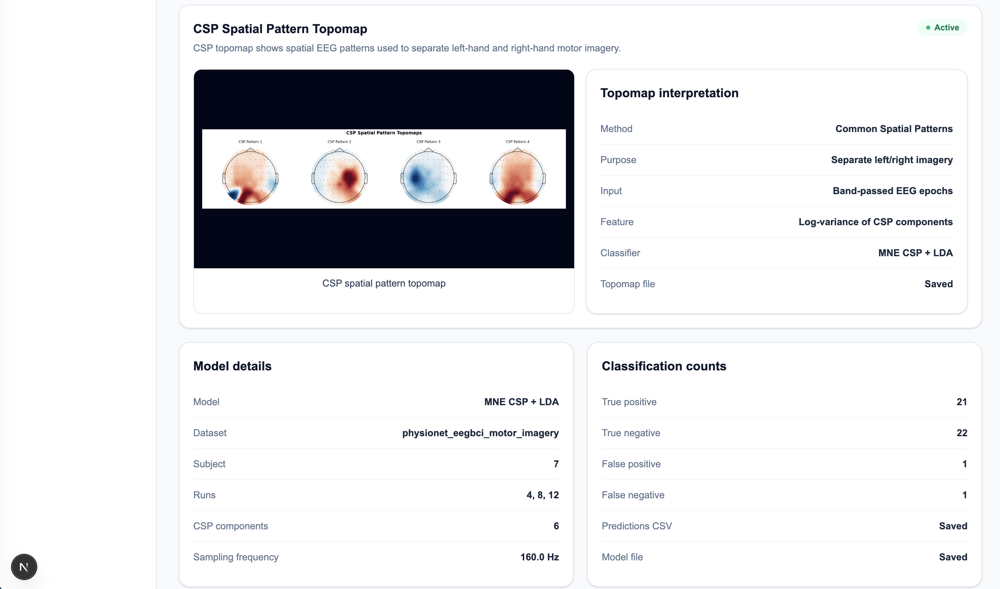
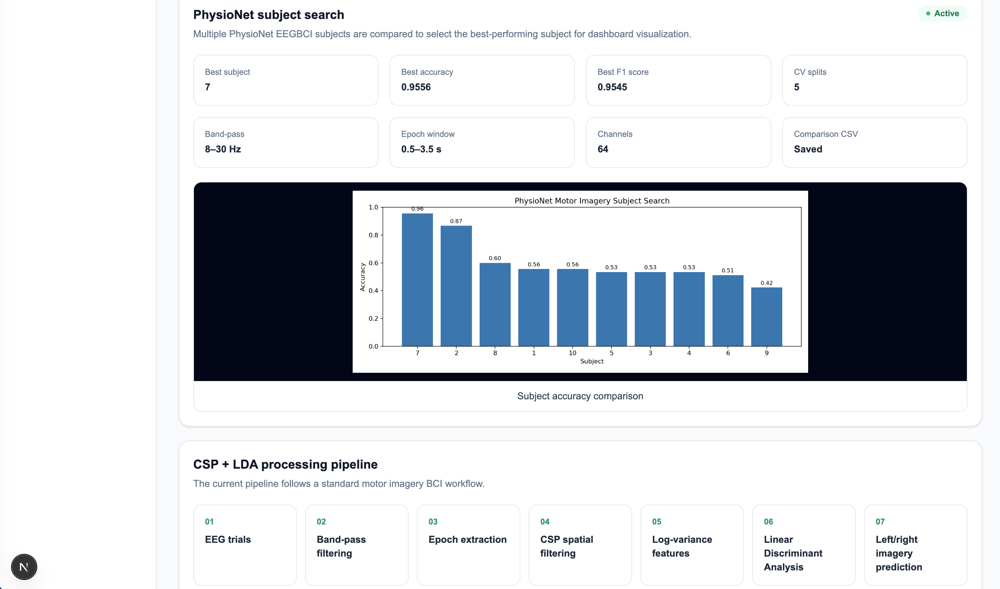

# NeuroFusion-AI

**NeuroFusion-AI** is a full-stack neuroscience AI dashboard that combines MRI and EEG machine learning workflows in one web application.

The project demonstrates how medical imaging, EEG signal analysis, machine learning, backend APIs, and modern frontend dashboards can be integrated into a single portfolio system.

---

## Screenshots

### Overview Dashboard



The overview page summarizes the current status and key metrics from all three AI modules.

### MRI Tumor Segmentation





The MRI page shows tumor segmentation results with input MRI, ground-truth mask, predicted mask, overlay, and best/worst validation case comparison.

### EEG Seizure Detection





The seizure page shows EEG classification metrics, waveform visualization, probability timeline, and model output files.

### EEG Motor Imagery BCI





The motor imagery page shows CSP + LDA classification results, subject comparison, and CSP spatial topomap visualization.

---

## Main Modules

### 1. MRI Tumor Segmentation

This module performs brain tumor segmentation using a U-Net-style model on MRI slices.

Main features:

* Input MRI, ground-truth mask, predicted mask, and overlay visualization
* Dice and IoU evaluation metrics
* Case-level and slice-level validation results
* Best and worst validation case visualization

---

### 2. EEG Seizure Detection

This module classifies EEG signals for seizure detection.

Main features:

* EEG feature extraction
* Random Forest-based seizure classification
* Accuracy, sensitivity, specificity, and F1 score reporting
* EEG waveform visualization
* Seizure probability timeline
* Prediction CSV output

---

### 3. EEG Motor Imagery BCI

This module classifies left-hand versus right-hand motor imagery EEG signals.

Main features:

* PhysioNet EEGBCI data processing
* CSP spatial filtering
* LDA classification
* Subject-level performance comparison
* Confusion matrix
* CSP spatial topomap visualization

---

## Tech Stack

### Backend

* Python
* FastAPI
* NumPy
* Pandas
* Scikit-learn
* PyTorch
* MNE
* Matplotlib

### Frontend

* Next.js
* React
* TypeScript
* Tailwind CSS
* lucide-react

### Machine Learning

* U-Net-style MRI segmentation
* Random Forest seizure detection
* CSP + LDA motor imagery classification

---

## Project Structure

```text
neuro-fusion-ai/
├── backend/
│   ├── main.py
│   └── routers/
│       ├── mri.py
│       ├── seizure.py
│       └── motor.py
│
├── frontend/
│   ├── app/
│   │   ├── page.tsx
│   │   ├── mri/page.tsx
│   │   ├── seizure/page.tsx
│   │   └── motor/page.tsx
│   └── components/
│
├── scripts/
│   ├── evaluate_mri_validation.py
│   ├── generate_seizure_waveform_timeline.py
│   ├── generate_seizure_predictions_csv.py
│   └── train_motor_imagery_physionet_subject_search.py
│
├── src/
│   ├── mri_segmentation/
│   ├── seizure_detection/
│   └── motor_imagery/
│
├── results/
├── models/
├── data/
├── screenshots/final/
└── README.md
```

---

## How to Run

### 1. Start the backend

```bash
uvicorn backend.main:app --reload
```

Backend:

```text
http://127.0.0.1:8000
```

API documentation:

```text
http://127.0.0.1:8000/docs
```

### 2. Start the frontend

```bash
cd frontend
npm install
npm run dev
```

Frontend:

```text
http://localhost:3000
```

---

## Dashboard Pages

```text
Overview:
http://localhost:3000

MRI Tumor Segmentation:
http://localhost:3000/mri

EEG Seizure Detection:
http://localhost:3000/seizure

EEG Motor Imagery BCI:
http://localhost:3000/motor
```

---

## API Endpoints

```text
GET /api/mri/status
GET /api/seizure/status
GET /api/motor/status
```

The frontend reads these endpoints to display live model metrics and result images.

---

## Generate Result Files

### MRI validation outputs

```bash
python -m scripts.evaluate_mri_validation
```

### Seizure waveform and timeline

```bash
python -m scripts.generate_seizure_waveform_timeline
python -m scripts.generate_seizure_predictions_csv
```

### Motor imagery results

```bash
python -m scripts.train_motor_imagery_physionet_subject_search
```

---

## Current Highlights

* Full-stack FastAPI + Next.js dashboard
* Three neuroscience AI workflows in one interface
* Live API-connected overview page
* MRI best/worst validation case visualization
* EEG seizure waveform and probability timeline
* EEG motor imagery CSP topomap
* Clean medical-style dashboard UI
* Brain favicon and final screenshots for portfolio presentation

---

## Future Improvements

Planned improvements include:

* True window-level seizure prediction CSV
* Shared reusable dashboard components
* Unified `/api/summary` endpoint
* Automated backend and frontend tests
* Short demo video or deployment guide

---

## Disclaimer

This project is for research, education, and portfolio demonstration only.

It is not intended for clinical diagnosis, treatment decisions, or real-time patient monitoring.
